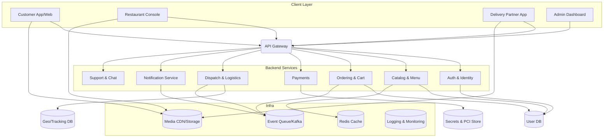
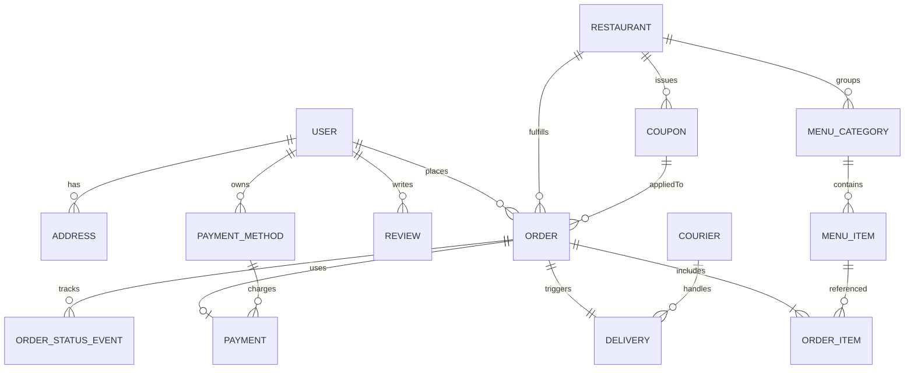

# Food Delivery Platform

This repository outlines a full-stack food delivery platform similar to Swiggy, DoorDash, or Uber Eats. It captures the core modules, flows, and infrastructure pieces you can use as a blueprint for implementation.

## System Architecture Diagram



**Flow summary**
- Clients hit the `API Gateway`, which handles routing, auth, throttling, and observability hooks.
- Domain services own their respective data stores and publish events to a shared queue for async processing (notifications, dispatch, analytics).
- Real-time tracking blends `Dispatch`, `Notification`, and cache/streaming layers to push updates to users and couriers.

## Repository layout

```
apps/
  api-gateway/          # NestJS edge/BFF (bootstrapped)
  admin-api/            # Placeholder NestJS module for ops
  graphql-api/          # Placeholder NestJS Apollo subgraph
services/
  node/
    auth-service/           # NestJS + Fastify + SQLite
    catalog-service/        # Fastify + Mongo
    dispatch-service/       # Fastify + Redis
    notifications-service/  # Fastify + providers
  python/
    payments-service/       # FastAPI + Vault/PSP
packages/
  contracts/            # API/event schemas
  shared/               # Cross-language helpers
infra/
  docker/               # Compose stack
  k8s/                  # Future manifests/Helm
```

## Installing dependencies

This repo now uses npm workspaces so you can install every Node service’s dependencies from the root once:

```bash
npm install
```

Use workspace-aware scripts when you want to target an individual package:

```bash
# Run auth-service in watch mode
npm run start:dev --workspace services/node/auth-service

# Lint every workspace at once
npm run lint
```

You can still `cd` into a service and run its scripts directly if you prefer, but keeping installs at the repo root ensures a single `node_modules` tree and consistent lockfile.

## ER Diagram / Data Model



**Entity highlights**
- `USER` links to multiple addresses, stored payment methods, orders, and reviews.
- `RESTAURANT` organizes its menu through `MENU_CATEGORY` → `MENU_ITEM`, issues `COUPON`s, and is tied to each `ORDER`.
- `ORDER` is the hub entity: it references `ORDER_ITEM`s, payment records, coupon usage, and spawns `DELIVERY` plus historical `ORDER_STATUS_EVENT`s for timeline audits.
- `COURIER` captures delivery partner metadata and connects straight to the `DELIVERY` table for SLA/qc analysis.

Use this ERD as a baseline—extend with analytics, loyalty, or multi-tenant requirements as needed.

## Key Features

- **User & authentication** – registration/login via phone, email, or social, JWT/OAuth tokens, saved addresses, and notification settings.
- **Restaurant management** – onboarding, menu CRUD, inventory, pricing, and payout dashboards for partners.
- **Menu & discovery** – advanced search, filters, personalized recommendations, and dietary tagging.
- **Cart & order flow** – live validation, bill breakdown, tips, and order history with one-tap reorders.
- **Checkout & payments** – payment gateway integrations, multi-method support (UPI, cards, wallets, COD), refunds, and invoices.
- **Dispatch & logistics** – intelligent rider allocation, batching, routing, and SLA tracking.
- **Real-time tracking** – WebSocket/MQTT updates for prep status, rider location, and ETAs.
- **Offers & loyalty** – coupon engine, restaurant promos, wallet cashbacks, and subscription tiers.
- **Ratings & support** – rich feedback, dispute workflows, help center, and in-app chat/call masking.
- **Admin & analytics** – consolidated management console, system monitoring, fraud detection, and operational dashboards.

## Microservices Breakdown

| Service | Responsibilities | Tech & Data Notes |
| --- | --- | --- |
| API Gateway | Routing, throttling, auth enforcement, schema validation, observability hooks | Nginx/Kong/API GW + OIDC; integrates with WAF and rate limiter |
| Auth & Identity | User/Courier/Restaurant auth, session/token issuance, MFA, RBAC | Relational DB for accounts, Redis for session blacklist, integrates with IdP |
| User Profile | Addresses, preferences, saved payments (tokens), notifications settings | Relational DB; PCI data vaulted via Payments service |
| Restaurant Catalog | Restaurants, menus, availability, pricing, promotions, inventory | Relational DB + Redis cache; S3/CDN for media assets |
| Search & Discovery | Full-text search, personalization, trending feeds, recommendations | Search engine (Elasticsearch/OpenSearch) + feature store |
| Cart & Ordering | Cart state, validation, order creation, promo application, bill calc | Relational DB with optimistic locking; emits order events |
| Payment Orchestrator | Payment intents, gateway routing, refunds, payout reconciliation | Integrates with PSPs; stores minimal sensitive data, uses secure vault |
| Dispatch & Logistics | Order allocation, courier assignment, batching, routing, ETA computation | Uses geo DB, Redis, and event stream; integrates with Maps APIs |
| Courier Operations | Courier onboarding, status, compliance docs, earnings | Relational DB + document storage; ties into Dispatch |
| Notification Service | Push/SMS/email templates, sequencing, preference management | Message queue + transactional email/SMS providers |
| Support & Chat | Ticketing, in-app chat, bot handoff, call masking | Stores conversations, integrates with CRM/Support tooling |
| Analytics & Reporting | Aggregations, dashboards, growth/ops metrics | Data lake/warehouse, scheduled ETL jobs, BI connectors |
| Admin Console | Combines privileged APIs for ops, finance, growth, compliance | Primarily consumes other services via service-to-service auth |

**Deployment considerations**
- Services communicate via gRPC/REST for synchronous flows and Kafka (or equivalent) for events (`order.created`, `delivery.statusChanged`, `payment.refunded`, etc.).
- Shared libraries define protobuf/OpenAPI contracts to keep types aligned across repos.
- Apply zero-trust networking between services, with service mesh (e.g., Istio/Linkerd) handling mTLS, retries, circuit breaking, and telemetry.

## Next Steps

1. Scaffold service repositories (or monorepo modules) to match the architecture above.
2. Define API contracts and message schemas for high-throughput flows (orders, dispatch, notifications).
3. Stand up CI/CD, observability, and automated testing (unit, contract, E2E) to keep the platform reliable as it scales.

